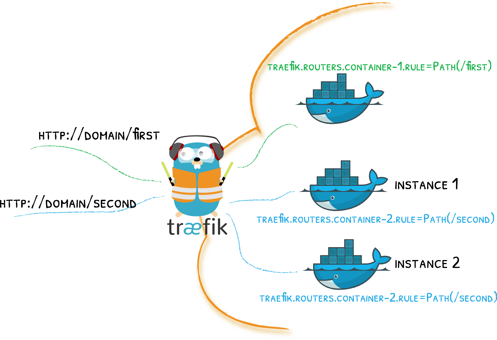

# Use traefik as a reverse proxy in development of multiple docker services on MacOS



[This is link to the original repository](https://github.com/thebrubaker/traefik-docker) followed by original readme without any changes. 


Traefik (pronounced _traffic_) is a modern HTTP reverse proxy and load balancer that integrates directly with your existing docker infrastructure. You can read more information about Traefik at their [repository](https://github.com/containous/traefik) or by going through their [documentation](https://traefik.io/).

If you are like me, you might have many different projects running at the same time with various port bindings that often conflict, or are difficult to remember. This small setup was built to solve the challenges associated with managing dozens of different port bindings on local development with docker.

Instead of accessing your application at `http://localhost:8005` you can now access it at `http://containerName.test` For example, if you had the following docker container running, your container would be available at [http://whoami.test](http://whoami.test)

``` shell
docker run --rm -d --network=proxy --name=whoami containous/whoami:v1.3.0
```

## System Requirements
This setup was built to support development on a Mac OS environment. You can likely tweak these settings to support other environments with a little research and configuration. This guide assumes you have the following:
- Mac OS
- Docker
- Homebrew

## Setup
The following instructions will get you started with Traefik. All you need is this repository and the tool `dnsmasq` which will point the `.test` domain to localhost.

To start, clone this repository. I cloned it into `$HOME/.config/traefik`

Create a proxy docker network
``` shell
docker network create proxy
```

Install dnsmasq to route `.test` domains to localhost
``` shell
brew install dnsmasq
```

Add `.test` domain to dnsmasq configuration
``` shell
echo address=/.test/127.0.0.1 >> $(brew --prefix)/etc/dnsmasq.conf
```

Create the following resolver at `/etc/resolver/test`
```
nameserver 127.0.0.1
domain test
search_order 1
```

Start dnsmasq through homebrew
``` shell
sudo brew services stop dnsmasq && sudo brew services start dnsmasq
```

Generate certificates for .test domain
``` shell
(cd certs && bash generate-test-cert.bash)
```

Run traefik as a container on the proxy network
``` shell
docker-compose up -d
```

If your setup worked, you should be able to go to [http://traefik.proxy.test](http://traefik.proxy.test) (assuming you cloned this into a directory called traefik) and you will see the Traefik dashboard, which details all of the exposed services.

All docker containers that exist within the `proxy` network are proxied by traefik.

Docker-compose containers are hosted at `http://(projectName).(serviceName).test` and regular docker containers will be hosted at `http://(containerName).test`

To add a container to the proxy network in a docker-compose file, you can add the following to your compose file:
``` yaml
version: "3.8"
services:
  serviceName:
    networks:
      - proxy

networks:
  proxy:
    external: true
```

### Enable TLS Support
Within your docker compose file, add the following labels to enable TLS:
``` yaml
version: "3.8"
services:
  serviceName:
    labels:
      # Enables redirect to https, replace `containerName`
      - "traefik.http.routers.containerName-insecure.entrypoints=web"
      - "traefik.http.routers.containerName-insecure.middlewares=redirect-to-https"

      # Enables TLS with a self-signed .test certificate, replace `containerName`
      - "traefik.http.routers.containerName.entrypoints=web-secure"
      - "traefik.http.routers.containerName.tls=true"
```

### Custom Host Name
Within your docker compose file, add the following labels to use a custom host name:
``` yaml
version: "3.8"
services:
  serviceName:
    labels:
      - "traefik.http.routers.containerName.rule=Host(`custom-name.test`)"
```